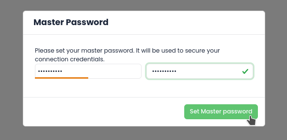
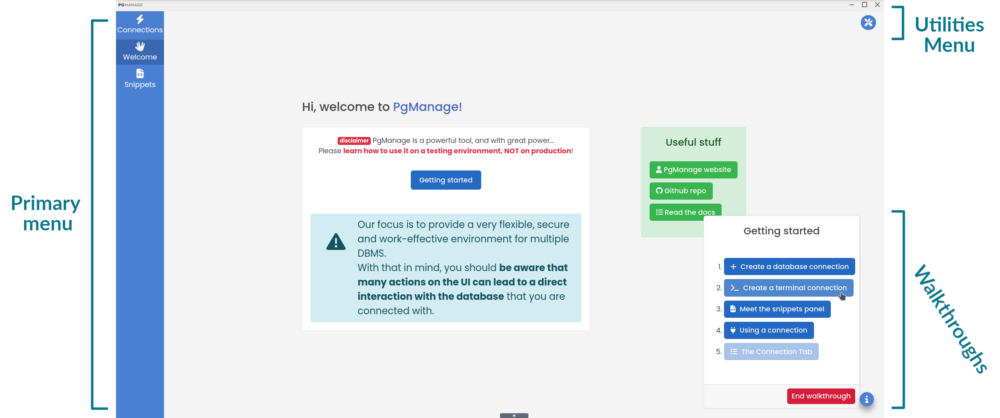
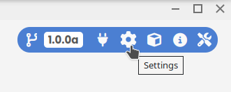
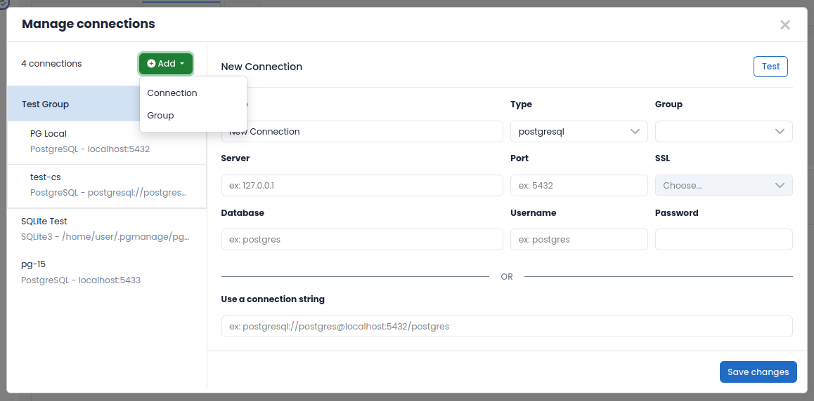

# Quick Start

## Install Quide

Download the PgManage distribution file for your platform from the [Command Prompt website](https://www.commandprompt.com/products/pgmanage/).

### Linux

PgManage for Linux is packaged in `.AppImage` format and does not require installation. Download PgManage's `.AppImage` file. Then, in the command line, change to the directory containing the downloaded file, make it executable, and run it:

```
chmod +x ./pgmanage-$version.AppImage
./pgmanage-$version.AppImage
```

### Windows

Run the PgManage setup executable and follow the installation instructions.

**FIXME:** add PostgreSQL command line tools installation instructions

### Mac

Download the `DMG` file and double click on it and drag the PgManage icon to the `Applications Folder` icon.

**FIXME:** add PostgreSQL command line tools installation instructions

### Oracle Support

A note about extra dependencies for Oracle support.
Application File locations (pgmanage.db pgmanage.log on different platforms)

## Launching the App

When the application starts for the first time, it will prompt a message to set up a master password. Fill up the provided fields and press `Set master password`.
This password will be requested the next time you open the application but you may reset it with a `Reset Master Password` button. 

>**Note:** resetting the master password will erase all the information that was encrypted with it, including database connection credentials.



Next, you will be greeted with the application welcome page:



To get started, you may press the information icon on the button right corner to access the step-by-step walkthroughs.

The utilities menu is located at the top right corner. From there, you may access the application settings, view the application version, and general application info.



On the primary menu, one can manage connections, switch between active database sessions, and access the snippets, which will be discussed later in this documentation.

## Protected Credentials Storage

PgManage stores sensitive data, such as database access credentials and SSH keys, encrypted with a Master Password. Resetting the master password will erase all the protected application data.

## Creating your first DB connection

Click on the ⚡ icon on the left sidebar, the connection management UI will be shown:
  
  

Connections and Connection Groups are shown on the left. Clicking on the left panel items shows the item’s view/edit form. Click on `➕ Add → Connection`. Set the connection title and database type; the rest of the form will change depending on the database type selected. Fill in the rest of the database connection properties.

> **Note:** Alternatively, the connection string may be used to establish a database connection.

There are two special connection types, which behave differently:

- **SQLite connections** do not need any other settings besides the sqlite3 file path.
- **Terminal connections** are not database connections, since they require setting SSH tunnel properties.

> **Note:** the password field is optional. If you leave it empty, the password prompt will be shown each time before establishing the connection. For PostgreSQL connections, PgManage will also try to retrieve the connection password from the `.pgpass` file.

### SSH Tunnelling

In addition to direct database connections, PgManage can also connect to the database server via an SSH tunnel. This feature is useful when the database server is not directly accessible, but can be accessed via an intermediate SSH server host. To use SSH tunneling toggle the corresponding switch and enter the SSH credentials for the intermediate host.

### Testing and Saving the Connection

The connection properties can be validated before saving the connection. To do so, click the `Test` button on the top of the connections dialog. If the test is successful, click `Save`.

### Connection Groups

Related connections can be grouped by clicking the `➕ Add` button and selecting the `Group` option. On the `Group` form, enter a name for the new connection group and select the connections to be grouped; click `Save`. You may also group/ungroup a particular connection from the connection edit screen by selecting the corresponding option in the `Group` dropdown.

## Connecting to the Database

You can access existing connections in two ways:

- from the **connections menu** by clicking the ⚡ item on the left sidebar.
- from the **connection management dialog** by clicking the connection item on the left. Then, click the `Connect` button.